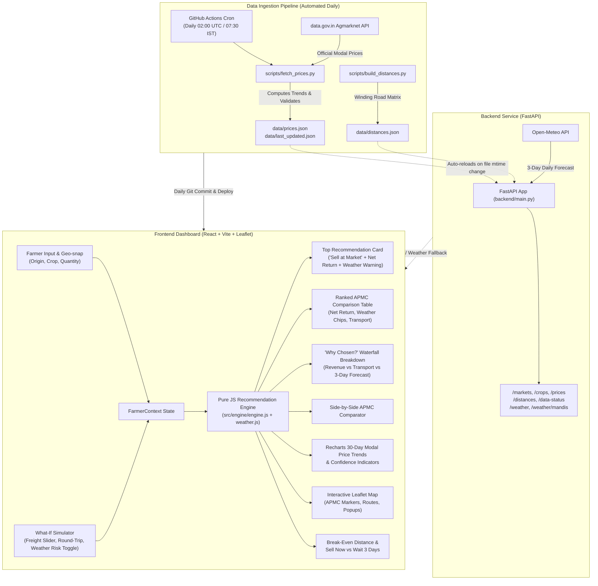

# 🌾 MandiMitra AI (मंडी मित्र एआई / शेतकरी मित्र)
### Smart Market Recommendation Platform for Farmers

[](https://sheikh-mujahid.github.io/MandiMitra/)
[](https://github.com/Sheikh-Mujahid/MandiMitra/actions/workflows/daily-update.yml)
[](https://sheikh-mujahid.github.io/MandiMitra/)
[](https://opensource.org/licenses/MIT)

> **"Highest price is not always highest profit."**  
> MandiMitra AI empowers farmers to maximize net in-pocket income by ranking nearby agricultural markets (mandis) based on **expected net return** after accounting for road distance, vehicle logistics, handling charges, mandi cess, and price trends.
>
> 🌐 **Live Demo (GitHub Pages):** [https://sheikh-mujahid.github.io/MandiMitra/](https://sheikh-mujahid.github.io/MandiMitra/)  
> 🌐 **Live Demo (Vercel):** [https://mandimitra.vercel.app](https://mandimitra.vercel.app) *(Alternative Mirror)*  
> 📦 **GitHub Repository:** [https://github.com/Sheikh-Mujahid/MandiMitra](https://github.com/Sheikh-Mujahid/MandiMitra)

---

## 📌 Problem Statement

Mandi modal prices, transport freight rates, and daily price trends differ significantly across agricultural produce market committees (APMCs). Farmers often travel to distant terminal markets chasing a higher posted mandi rate, only to discover that:
1. **Transport eats the premium**: Hauling 50 quintals 140 km further can easily cost ₹5,000–₹8,000 extra in diesel, driver fees, and return empty haulage (deadheading).
2. **Hidden deductions compound**: Mandi cess (0.5%–1.5%), handling & weighment fees (₹15–₹25/q), and transit spoilage (0.5%–2%) drastically reduce nominal revenue.
3. **Price volatility & lag**: Mandis posting yesterday's high prices may be crashing due to sudden harvest arrival gluts.

**The Golden Insight**: A local mandi with a modal price of ₹2,970/q located 45 km away often leaves the farmer with **thousands of rupees more net cash** in hand than a distant market posting ₹3,070/q located 188 km away.

---

## 💡 The Solution: MandiMitra AI

MandiMitra AI provides an interactive, client-side decision dashboard that computes the **true net return** for every accessible mandi in real time:
- **Instant Client-Side Calculations**: Zero server round-trips for slider changes—rankings, charts, routes, and explanations update under 5 milliseconds.
- **Explainable AI ("Why this market?")**: Crystal-clear structured rationale comparing the #1 recommendation against the runner-up and nearest APMC.
- **Interactive What-If Simulation**: Test what happens if diesel prices rise, harvest quantity changes, or market rates drop ±10%.
- **Weather-Aware Intelligence & Risk Advisory**: Integrates live 3-day Open-Meteo forecasts for each mandi and farm location. Interactive weather chips display weather code icons, max temperatures, and precipitation probabilities. High-visibility warning banners alert farmers when the #1 market faces rain or storm risks, recommending the best clear-weather alternative and calculating the exact profit difference.
- **Audited Weather Risk Adjustments**: Optional risk adjustment toggle ("Include weather risk in ranking") applies small, documented penalties (0% clear, 0.5% caution, 1.5% risk) only when activated—weather never silently alters default rankings.
- **Farmer-Friendly Multilingual UI**: Full native support for **English**, **Hindi (हिंदी)**, and **Marathi (मराठी)** with large readable fonts and high-contrast badges.
- **Pitch Deck & Presentation**: Complete slide-by-slide speaker notes and demo guide available in [docs/GAMMA_DECK_NOTES.md](docs/GAMMA_DECK_NOTES.md).

---

## 🏗️ System Architecture



---

## ⚖️ How We Differ from e-NAM, AGMARKNET & Similar Portals

Existing government portals perform vital public reporting, but they were built as **price reporting registries**, not **decision optimization engines for individual farmers**.

| Dimension | AGMARKNET / State Portals | e-NAM Portal | **MandiMitra AI** |
| :--- | :--- | :--- | :--- |
| **Primary Purpose** | Historical price record & daily modal price bulletin | Online auction & inter-mandi trade platform | **Farmer net-profit optimization & logistics decision tool** |
| **Transport Factoring** | ❌ None (assumes zero transport cost) | ❌ Disconnected from farm logistics | ✅ **Full vehicle capacity, ₹/km rate & round-trip deadheading model** |
| **Hidden Cost Deductions** | ❌ None | ⚠️ Variable trading fees | ✅ **Loading (hamali), weighment (tolai), APMC cess & transit spoilage** |
| **Weather Risk Advisory** | ❌ None | ❌ None | ✅ **3-Day Open-Meteo forecast, storm warning & optional risk-adjusted ranking** |
| **Decision Metric** | Gross Modal Price (₹/q) | Auction Bid (₹/q) | **True Net In-Pocket Cash (₹)** |
| **What-If Simulation** | ❌ Static tables | ❌ No simulation | ✅ **Instant sliders for quantity, transport rates, and price shocks (±10%)** |
| **Explainability** | ❌ Raw numbers only | ❌ None | ✅ **"Why this market?" plain-language rationale & waterfall breakdown** |
| **Temporal Timing** | ❌ Yesterday's static report | ❌ Live bid screen only | ✅ **Sell Now vs. Wait 3 Days scenario analysis with storage & risk** |
| **Break-Even Analysis** | ❌ None | ❌ None | ✅ **Break-Even Distance card (max extra km before higher price is lost)** |

---

## 📐 Mathematical Calculation Formulas

Every calculation in MandiMitra AI is strictly audited and executed identically in both client-side JavaScript (`frontend/src/engine/`) and server-side Python (`backend/engine.py`):

### 1. Expected Price
$$\text{expectedPrice} = \text{modalPrice} \times (1 + \text{trendAdjustment} + \text{userPriceChange})$$
*where `trendAdjustment` is capped at $\pm 5\%$ and `userPriceChange` is adjusted via the What-If slider $(\pm 10\%)$.*

### 2. Gross Revenue
$$\text{revenue} = \text{expectedPrice} \times \text{quantity}$$

### 3. Freight / Transport Cost
$$\text{vehiclesNeeded} = \left\lceil \frac{\text{quantity}}{\text{vehicleCapacity}} \right\rceil$$
$$\text{transportCost} = \text{vehiclesNeeded} \times \text{distanceKm} \times \text{ratePerKm} \times (\text{roundTrip} ? 2 : 1)$$

### 4. Other Costs & Mandi Deductions
$$\text{loadingCost} = \text{loadingRatePerQntl} \times \text{quantity}$$
$$\text{marketFee} = \text{revenue} \times \frac{\text{marketFeePercent}}{100}$$
$$\text{commission} = \text{revenue} \times \frac{\text{commissionPercent}}{100}$$
$$\text{transitWastage} = \text{revenue} \times \text{spoilagePerKm} \times \min(\text{distanceKm}, 300)$$
$$\text{otherCosts} = \text{loadingCost} + \text{marketFee} + \text{commission} + \text{weighment} + \text{transitWastage}$$

### 5. Net Return (In-Pocket Profit)
$$\mathbf{netReturn} = \text{revenue} - \text{transportCost} - \text{otherCosts}$$

### 6. Break-Even Distance
For a distant market $B$ with higher modal price $P_B$ compared to baseline market $A$ with price $P_A$:
$$\Delta\text{Revenue} = (P_B - P_A) \times \text{quantity}$$
$$\text{EffectiveFreightPerKm} = \text{vehiclesNeeded} \times \text{ratePerKm} \times (\text{roundTrip} ? 2 : 1) + (\text{revenue}_B \times \text{spoilagePerKm})$$
$$\mathbf{breakEvenDistance} = \text{distance}_A + \frac{\Delta\text{Revenue}}{\text{EffectiveFreightPerKm}}$$
*If market $B$ is located further than this distance, the farmer is financially worse off despite the higher price.*

### 7. Weather Risk Adjustment (Optional Toggle)
$$\mathbf{weatherPenalty} = \begin{cases} 0.0\% & \text{Level "clear"} \\ 0.5\% & \text{Level "caution" (rain 5--20mm or heat } > 40^\circ\text{C)} \\ 1.5\% & \text{Level "risk" (rain } \ge 20\text{mm, prob } \ge 70\%, \text{thunderstorm, or wind } > 40\text{km/h)} \end{cases}$$
$$\mathbf{netReturn}_{\text{weather}} = \mathbf{netReturn} \times (1 - \mathbf{weatherPenalty})$$
*Crucial Design Rule: This adjustment is applied **strictly when the "Include weather risk in ranking" toggle is ON**. Default is OFF, guaranteeing that default rankings are never altered silently.*

---

## 🛡️ Data Source & System Boundaries

### Official Sources
1. **Agmarknet Daily Price Feed**: Sourced via the Open Government Data (OGD) Platform India ([data.gov.in](https://data.gov.in)), resource ID `9ef84268-d588-465a-a308-a864a43d0070`.
2. **Open-Meteo Weather Forecast API**: Live 3-day daily forecasts queried without API keys via [open-meteo.com](https://open-meteo.com/v1/forecast) using verified APMC coordinates. Cached in-memory for 30–60 minutes with graceful offline fallback.

### Transparent Limitations
1. **Modal Prices, Not Live Ticks**: Mandi prices are official daily **modal prices** (the single price at which the highest volume traded during the day). They are not live real-time auction bids.
2. **Quality & Grade Dependency**: Official modal prices reflect standard fair average quality (FAQ). Actual realization depends on variety, moisture content, cleanliness, and auction grading.
3. **Price & Weather Forecast Disclaimer**: Near-term trend adjustments, 3-day wait scenarios, and weather predictions are algorithmic statistical indicators and are explicitly marked **"Forecasts and estimates may change."**
4. **Daily Sync Frequency**: Mandis publish summaries once daily after trading closes (typically between 17:00 and 20:00 IST). Our daily workflow syncs updates at 02:00 UTC (07:30 IST) ready for morning dispatch planning.

---

## 🔄 Daily Automated Update Workflow

The daily pipeline is fully hands-free via GitHub Actions (`.github/workflows/daily-update.yml`):
1. **Trigger**: Scheduled cron `0 2 * * *` (07:30 AM IST) + manual `workflow_dispatch`.
2. **Execution**:
   ```bash
   python scripts/fetch_prices.py --source agmarknet --days 30
   python scripts/build_distances.py
   ```
3. **Quality Gate**: Validates that all active commodities (Wheat, Soybean, Cotton, Onion, Gram) have valid modal prices and recent date stamps.
4. **Commit & Deploy**: Automatically commits updated `data/prices.json` and `data/last_updated.json` to `main`, triggering automated zero-downtime rebuild to GitHub Pages.

---

## 💻 Local Setup & Developer Guide

### Prerequisites
- **Node.js**: v18.0.0 or higher
- **Python**: v3.10 or higher
- **Git**

### 1. Clone & Setup Repository
```bash
git clone https://github.com/Sheikh-Mujahid/MandiMitra.git
cd MandiMitra
```

### 2. Frontend Setup (React + Vite)
```bash
cd frontend
npm install
npm run dev
```
Dashboard opens at: `http://localhost:5173`

Run Engine Unit Tests (Vitest):
```bash
npm test
```

### 3. Backend Setup (FastAPI)
```bash
cd ../backend
python -m venv venv
# Windows:
.\venv\Scripts\activate
# Linux/macOS:
source venv/bin/activate

pip install -r requirements.txt
python -m uvicorn backend.main:app --reload --port 8000
```
API Documentation (Swagger UI): `http://localhost:8000/docs`

Run Backend Test Suite (Pytest):
```bash
python -m pytest backend/test_backend.py -v
```

---

## ☁️ Deployment & Environment Configuration

### Frontend Deployment (GitHub Pages / Vercel / Netlify)
- **GitHub Pages**: Configured via `.github/workflows/deploy-pages.yml`. Base path: `/MandiMitra/`.
- **Vercel / Netlify**:
  - Root directory: `frontend`
  - Build command: `npm run build`
  - Output directory: `dist`
  - Environment Variable: `VITE_API_URL` (optional, defaults to static JSON bundled with zero cold-start delay).

### Backend Deployment (Render / Railway)
- **Render.com**:
  - Environment: `Python 3`
  - Build Command: `pip install -r backend/requirements.txt`
  - Start Command: `uvicorn backend.main:app --host 0.0.0.0 --port $PORT`
- **Environment Variables**:
  ```env
  DATA_GOV_IN_API_KEY=your_api_key_here
  AGMARKNET_RESOURCE_ID=9ef84268-d588-465a-a308-a864a43d0070
  ALLOWED_ORIGINS=https://sheikh-mujahid.github.io,https://mandimitra.vercel.app,http://localhost:5173
  ```

---

## 🔮 Future Roadmap

1. **Moisture & Quality Grading Engine**: Allow farmers to input grain moisture percentage (e.g., 14% vs 12%) and calculate automated APMC dockage discounts before traveling.
2. **Shared Transport & Pooling (शेतकरी गट वाहतूक)**: Connect neighboring farmers heading to the same APMC to pool tractor or 14-ft truck loads, cutting individual freight costs by up to 50%.
3. **MSP Floor Check & Procurement Center Overlay**: Highlight nearby government MSP procurement centers when open market modal rates fall below official minimum support prices.
4. **Offline PWA & SMS Gateway**: Progressive Web App caching for offline field use, plus IVR / SMS query support for basic keypad phones.

---

## 📄 License
This project is open-source under the [MIT License](LICENSE).
